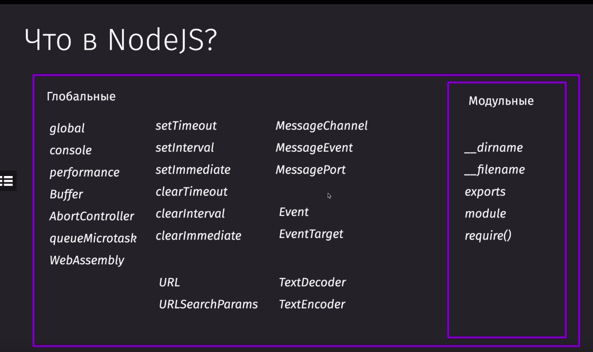

### commonJS / es module

### Переменные модульные и глобальные

##### Глобальные
global - объект, в котором лежат все остальные глобальные переменные

perfomance - для измерений

Buffer - глобальный объект для хранений и манипуляций с битовыми данными

AbortController - прерывает промисы

queueMicrotask - создание микротаски в v8

setTimeout/setInterval/setImmediat - таймеры

URL, URLSearchParams

MessageChannel, MessageEvent, MessagePort - используется для вебсокетов

Event/EventTaget - помогает работать с системой евентов

TextDecoder/TextEncoder

##### Модульные
__dirname - текушая дириктория путь
__filename - путь и название файла
exports = module.exports
module
require()