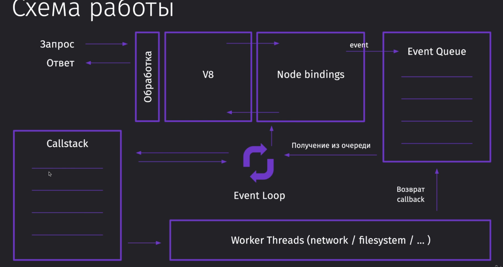
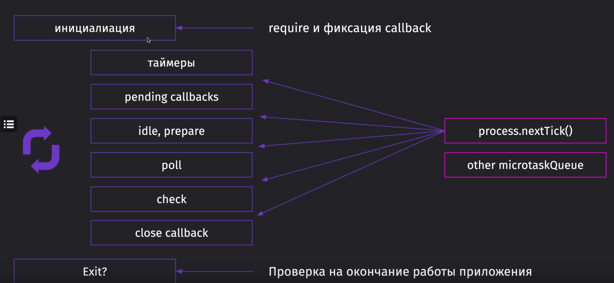
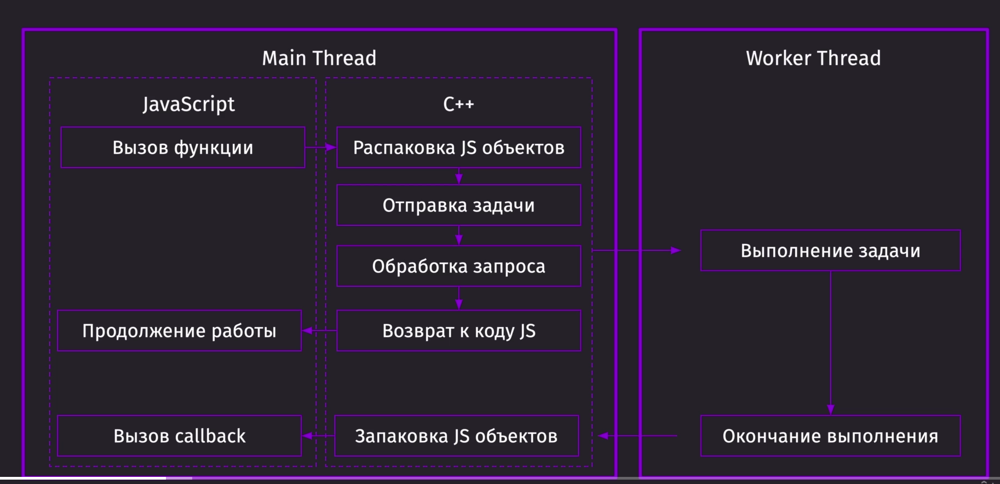

# Как работает/Поточность

«Однопоточность» означает, что в одном и том же процессе (в современных браузерах речь идёт об отдельных вкладках браузера) одновременно может выполняться лишь один набор инструкций.

Многопото́чность (англ. Multithreading) — свойство платформы (например, операционной системы, виртуальной машины и т. д.) или приложения, состоящее в том, что процесс, порождённый в операционной системе, может состоять из нескольких потоков, выполняющихся «параллельно», то есть без предписанного порядка во времени. При выполнении некоторых задач такое разделение может достичь более эффективного использования ресурсов вычислительной машины.

Такие потоки называют также потоками выполнения (от англ. thread of execution); иногда называют «нитями» (буквальный перевод англ. thread) или неформально «тредами».

Из Event Queue инструкции попадают в стек, где тяжелые операции уходят в Worker Threads и выполняются там,далее из Worker Threads возвращается колбек в EventQueue и EventLoop следит, очищен ли Callstack, чтобы добавить. Каждая операция, в конечном итоге, выдаст ответ из Callback в EventLooop.

### Фазы EventLoop:

- таймер - callback от запланированных таймеров 
  // nextTick -> Microtask (Между фазами)
- pending callbacks - callback от системы операций
  // nextTick -> Microtask (Между фазами)
- idle, prepare - внутреннее использоание
  // nextTick -> Microtask (Между фазами)
- poll - расчет времени и обработка событйи ввода/вывода (I/O)
  // nextTick -> Microtask (Между фазами)
- check - обработка setimmediate
  // nextTick -> Microtask (Между фазами)
- close callback - вызов событий "close", например сокеты

(Между каждой фазой происходят события: proccess.nextTick() && other microtaskQueue)

### Переход от main thread к worker thread

