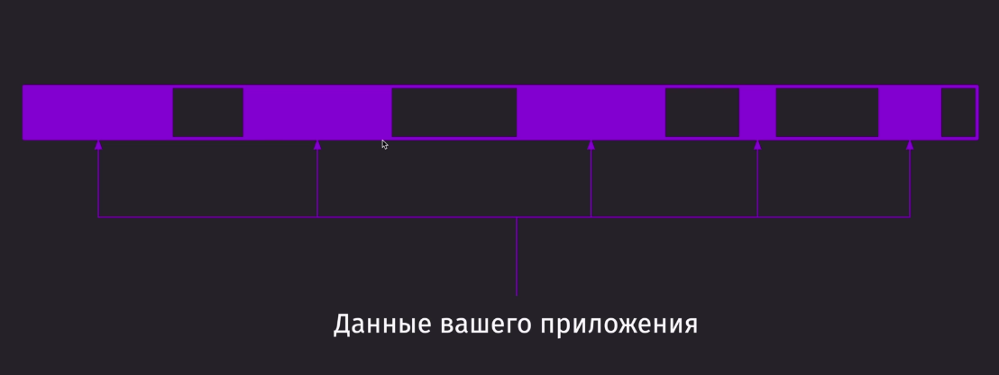
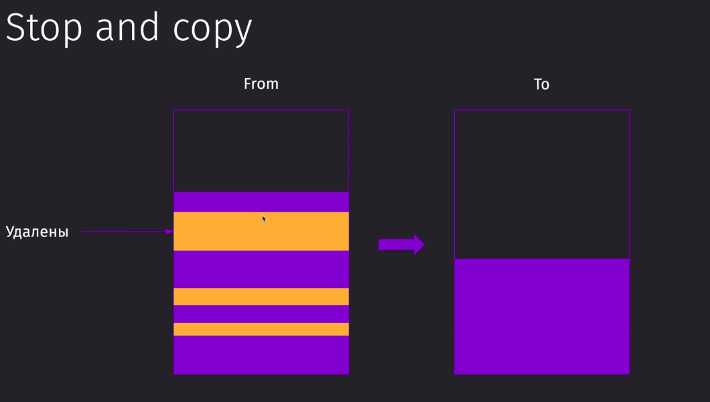
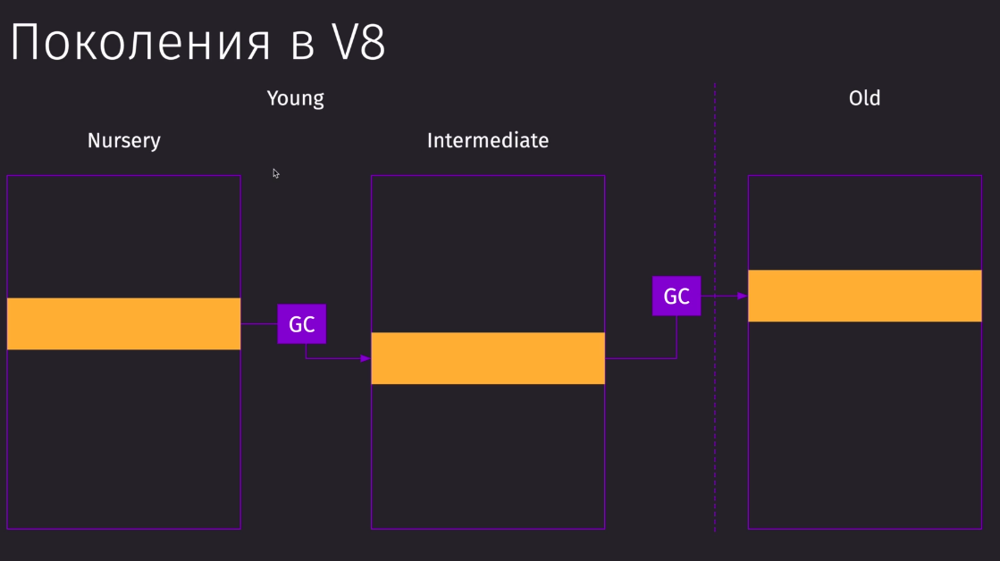

# Работа с памятью

Существует GarbageCollector, который автоматически занимается созданием/очисткой памяти.

Такой очисткой занимаются алгоритмы, которые делают Reference counting
Mark-sweep:
1) Проходит по глобальному объекту и помечается точки, на которые есть ссылка из предыдущей ноды
2) очищаем точки , до которых не добрались
(Проблема - круговые зависимости)

Есть алгоритм лучше Tri-color Mark:
1) Проходит первый уровень нод, помечая их серым цветом
2) Приходя на второй уровень нод, предыдущий уровень помечается черным (как имеещие потомков), то есть предварительно сохарнив состояние, а новый уровень по п.1
3) Не вошедшие ноды (белые ноды) можем вычестить

### Проблема памяти - фрагментация

Нефрагментированной память делает следующий алгоритм:

Поколения V8
